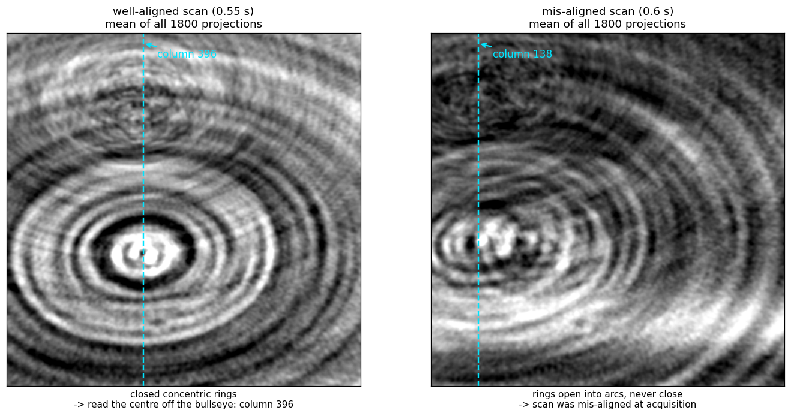

# tomoxide — Laminography alignment: finding the rotation center and tilt

A laminography reconstruction needs two numbers that the data file does not
carry: the **rotation center** and the **laminographic tilt**
(`--center`, `--lamino_angle`). This is the recipe that worked on real PLS-II
BL7C data, in the order it should be run.

> **Scope of the claims.** Every step below was validated on a scan whose answer
> was already known independently (`center = 396`, recovered earlier and confirmed
> against tomocupy at Pearson 0.99995 — see [`PORTING.md`](PORTING.md)
> `recon::lamino`). Steps that failed that validation are listed in
> [§6](#6-methods-that-failed-validation--do-not-retry) rather than quietly
> dropped. The numbers are from one instrument and one sample class; the
> *procedure* is the transferable part, not the values.

Only the **horizontal** center matters — the detector **column** of the rotation
axis. There is no vertical center to find: the tilt (`--lamino_angle`) is the
only other free parameter, and the axial position of the in-focus layer follows
from the geometry rather than being searched for.

---

## 1. Read the center off the raw data first

**Do this before reconstructing anything.** It costs one pass over the
projections and it also tells you whether the scan is worth reconstructing.

Average all projections of a 360° scan (flat-field corrected, minus-log). Every
object point at radius `r` from the axis traces `x(θ) = c + r·cos(θ + φ)` across
the detector, so averaging over a full turn smears each point into a **ring
centred on the rotation axis**. The mean projection is a bullseye, and its
centre column is `c`.



```python
def mean_proj(path, step=10):
    with h5py.File(path, "r") as f:
        w = f["exchange/data_white"][:].astype(np.float32).mean(0)
        d = f["exchange/data"]
        acc, n = None, 0
        for i in range(0, d.shape[0], step):           # every 10th frame is plenty
            m = -np.log(np.clip(d[i].astype(np.float32) / w, 1e-4, None))
            acc = m if acc is None else acc + m
            n += 1
    return acc / n
```

Read the bullseye column by eye. That is the whole method, and on the
well-aligned scan the eye lands within a few pixels of the answer that a full
reconstruction sweep produces.

### The rings are also the alignment check

- **Closed, concentric rings** → the scan is aligned; the bullseye column is the
  center.
- **Rings that open into arcs and never close** → the sample was not aligned to
  the rotation axis at acquisition. No choice of `--center` / `--lamino_angle`
  recovers this; it is a property of the measurement.

### Automating it (and why the eye still goes first)

Concentric rings are mirror-symmetric about the axis column, so registering the
mean projection against its own left–right flip gives `dx = 2·(c − nx/2)`:

```python
def ring_center_col(M):
    A = M - M.mean()
    B = A[:, ::-1]
    cc = np.fft.fftshift(np.fft.irfft2(np.fft.rfft2(A) * np.conj(np.fft.rfft2(B)),
                                       s=A.shape))
    ny, nx = A.shape
    prof = cc[ny // 2 - 2 : ny // 2 + 3].sum(0)        # rings -> peak on the mid row
    i = int(np.argmax(prof))
    y0, y1, y2 = prof[i - 1], prof[i], prof[i + 1]     # parabolic sub-pixel
    d = (y0 - y2) / (2 * (y0 - 2 * y1 + y2))
    return nx / 2 + ((i + d) - nx // 2) / 2
```

Measured: **397.5 vs a known 396 (+1.5 px)** on the aligned scan. On the
mis-aligned scan it returned **281 vs a true 138** — the incomplete arcs on one
side dominate the global correlation and drag the peak, while a human still
reads the bullseye at 138 without difficulty.

So: **eye first, correlation second, and treat a disagreement between them as the
misalignment flag** rather than as a number to average.

---

## 2. Coarse sweep with reconstructions

Take the column from §1 as the starting point and sweep. Two properties of the
scoring are load-bearing; both were learned by getting them wrong first.

- **Reconstruct from the FULL projection set.** On a 1/3 subsample the streak
  noise dominates and the focus metric tracks streaks instead of the sample.
- **Prep exactly once.** `normalize_dataset` already ends in the minus-log; a
  second `minus_log` on its output amplifies the noise floor everywhere the
  line integral is near zero while leaving the sample recognisable. On the
  aligned pouch scan the double-prepped volume ranked a pure-noise plane 1.7×
  above the eye-confirmed electrode, which made the whole-volume max
  unusable and was misread as a defect of the focus metric itself; with the
  prep fixed, the same metric puts the sample ≈6× **above** the noise floor
  and the unbanded tilt scan resolves 44° on its own (3.0× span over
  36..52°).
- **Score inside the sample's z band, carried to each tilt through the detector
  rows** (`tomoxide align --focus_z LO:HI`). Optional but load-bearing twice
  over: it is what the reference workflow does, and it keeps the score on the
  sample wherever structured noise still competes. A band cannot be *fixed* in
  z, though — the in-focus layer moves with the sample height *and* with the
  tilt: the sample's focus spike sits at z 837 / 890 / 956 at tilts 40° / 44° /
  48° (volume depths 1338 / 1424 / 1532).

  The resolution is that the sample's *detector rows* do not move — they are a
  property of the data, not of the reconstruction. On the axis the
  back-projection samples row `v − nz/2 = cos(tilt)·(z − rh/2)`, so state the
  band once, at the tilt of the reconstruction you read it from, and map it into
  each candidate's own volume (`tomoxide align --focus_z LO:HI`;
  `recon::center::SampleBand` in the library). The mapping lands on the measured
  spikes to ~1 px: carrying the 44° band predicts 836 / — / 957.

Focus score per slice: mean `|∇|²` inside a 0.92-FOV disk; take the max inside
the band. Correct geometry concentrates a thin layer into one sharp slice, so
the peak is high; wrong geometry spreads it. Read the band off one
reconstruction at your prior geometry — §3's eye check says which slices carry
round particles — or off the focus-by-slice profile the tilt scan reports.

**The symptom of a broken search is a monotone surface with the argmax pinned to a
grid corner.** That means the metric has no focus signal to lock onto — widen the
range or fix the scoring; do not report the corner as an optimum. A real optimum
looks unimodal:

```
center  125    130    135    140    150      (tilt 45)
focus  5.18   5.55   5.89   5.92   5.65      (×1e-7)
```

---

## 3. Confirm visually, without the metric

Render the candidate centers side by side, each windowed to **its own**
`p0.5/p99.5` percentiles, with a zoom. A window taken from one volume and applied
to another saturates the higher-contrast one into a fake-crisp binary look.

At the correct center the particles are **round**; a few tens of pixels away they
smear into **elongated dashes** arranged in a swirl. This is unambiguous by eye
and it is the check that catches a metric which has locked onto truncation
artefacts rather than focus. In the worked example below, eye and metric agreed —
which is the point of running both.

---

## 4. Fine 2D refine

Only now refine `(center, tilt)` together on a **small** grid. Small is the whole
point: both responses are broad, so a wide grid does not find an answer faster, it
finds a wrong one.

- Tilt: on the example data, 44/45/46 spanned 5.84/5.92/5.76 (×1e-7) — a ±1° error
  costs ~2%.
- Center: no sharper. Do not read the ~40%-per-50px figure that used to sit here —
  it was never measured. What was: on the aligned pouch scan (known axis 396,
  tilt 44°), a **21 px** error cost **0.34%**, and widening the sweep to ±40 px grew
  the curve **three** lobes whose highest stood at 417 — the wrong one, by a margin
  no rail check can see. Narrowed to ±8 px around the axis from §1, the same code
  returns 395.75.

So a `(center, tilt)` sweep **refines a prior; it does not find one**. Get the
center from §1's rings first, tilt second, and keep both grids tight enough that
there is only one lobe in them. `recon::center::judge_sweep` enforces this — it
returns no value from a curve with a rival lobe, and none from one that only rises.

---

## 5. Sanity check: the angular range

If the geometry search will not converge, verify the sweep is what the filename
claims. Rewrite `exchange/theta` to `linspace(0, R, nproj, endpoint=False)` for a
few `R`, reconstruct, and score:

```
R (deg)   350      355      360      365      370
focus    1.36     1.60     1.97     1.57     1.38     (×1e-6, aligned scan)
```

A correct range is a sharp peak — 360° beats ±10° by ~1.4× and beats 270°/450° by
5–8×. **Run this at a center you have already established**: the same scan scored
at a wrong center gives a meaningless range curve.

---

## 6. Methods that failed validation — do not retry

Each of these was tried on the scan with the known center and did not reproduce
it. They are recorded so the next person does not spend the time again.

| Method | Result on the known-center scan | Why it fails |
|---|---|---|
| **0°/180° mirror registration** | scattered 395…607 across projection pairs (true: 396) | The tilted axis has a component along the beam, so a 180° rotation is **not** a mirror of the object. The symmetry the method assumes does not exist in laminography. |
| **1-D column-profile symmetry of the mean projection** | 847 (true: 396) | The sample is wider than the FOV. Truncation destroys the symmetry of the 1-D profile; the 2-D ring pattern survives it. Use the rings, not the profile. |
| **Sub-sampled (1/3) projections + fixed z band** | monotone surface, argmax at a grid corner | Both failure modes of §2 at once. |

---

## 7. Worked example — the 2026-02-25/26 pouch pair

Two laminography scans of the same pouch cell, one day apart. They are **separate
experiments, not variants**: 18 hours and a remount apart, and the `_re2` suffix
on the second marks it as a retake.

| | 0.6 s scan (Feb 25) | 0.55 s scan `_re2` (Feb 26) |
|---|---|---|
| rings in the mean projection | open arcs, never close | closed, concentric |
| center (column) | 138 | **396** |
| tilt | 45° | 44° |
| `z_peak` | 848 | 888 |
| focus (max over z) | 5.9e-07 | **2.0e-06** |
| slice contrast (p0.5–p99.5) | 0.028 | **0.046** |

The center moved by 263 px (in 2×-binned detector columns) between the two scans.
Assuming the first scan's geometry transferred to the second is what made the
initial searches fail; the ring picture would have shown it in one pass.

The Feb 25 scan reaches 30% of the Feb 26 focus **and this is not recoverable by
reconstruction**: it was mis-aligned at acquisition, which is what the open arcs
report and why the scan was retaken. Its raw projections are individually just as
sharp (mean `|∇|²` 0.003535 vs 0.003509, 0.7% apart, identical high-frequency PSD)
— sharp projections that are mutually inconsistent. In a single-turn scan time and
angle are the same variable, so acquisition misalignment cannot be separated from
angle-dependent structure by any choice of `--center` / `--lamino_angle`.

> **Not established.** Both scans show `pearson(proj_0, proj_1799) ≈ 0.006 / 0.037`
> where a 360° sweep should give ≈0.97; smoothing to σ=64 px lifts it to 0.77 /
> 0.74, so the coarse view does return (the 360° range is correct) while individual
> particles do not — they rearrange over the 64-minute acquisition. This appears in
> **both** scans, including the good one, so it does not explain the difference
> between them and no mechanism is claimed here.
